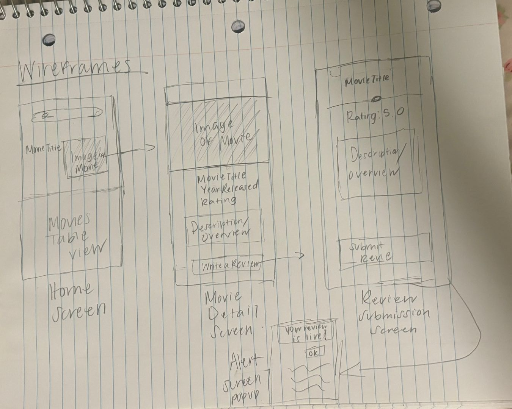

# Movie Review App

## Overview
### Description
Movie Review App allows users to review and rate movies they have watched. Users can discover new movies, share their thoughts. The app provides an intuitive platform for movie experiences and exploring user-generated reviews.

### App Evaluation
**Mobile:** The app is designed for mobile use, ensuring a seamless experience on phones and tablets.

**Story:** Users can log their movie experiences by submitting reviews and ratings, making it easy for others to discover new films based on authentic user opinions.

**Market:** The movie industry has a massive global audience, making this app relevant for millions of users who seek reliable movie reviews and discussions.

**Habit:** Users will frequently return to check reviews, look at other's opinions, and participate in discussions about films.

**Scope:** The core features focus on reviews and ratings, ensuring a valuable user experience while keeping the app manageable and efficient.

---

## Product Specification
### A. User Features
#### Required Features
1. **Movie Details** – Users can look at movie details.
2. **Movie Reviews & Ratings** – Users can submit text reviews and rating for movies.
3. **Movie Discovery** – Users can search movies.

## Optional Features// Future Features

Social Features – Users can follow other reviewers and see their movie activity.
Users Authentication - Users can sign up and log in. 
---

### B. Screen Archetypes
1. **Home Screen** – Displays trending and latest movie reviews.
2. **Movie Details Screen** – Shows information about a selected movie.
3. **Review Submission Screen** – Enables users to submit reviews and ratings.

---

### C. Navigation Flow
- **Home** – Displays trending and latest reviews.
- **Search** – Allows users to search for movies.
- **Movie Detail** - Display information
- **Reviews** - Allows users to review and rate.

#### **Flow Navigation**
1. **Home Screen** → Movie Details Screen
2. **Movie Details Screen** → Review Submission Screen
3. **Review Submission Screen** → Pop up Alert Box

---

## Wireframes

